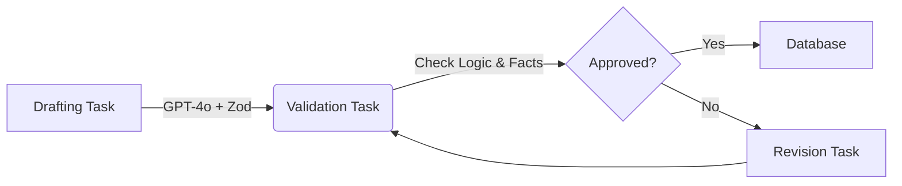

# AuditPath 🛡️

**Intelligent Adaptive Learning System for CIA & CISA Certifications**


AuditPath is not just a question bank; it's a **cognitive engine** designed to optimize learning retention through advanced algorithms and AI-driven content generation.

---

## 🧠 Core Intelligence: SRS & Shelf System

At the heart of AuditPath lies a sophisticated **Spaced Repetition System (SRS)** that adapts to your learning curve.

### The "Shelf" Logic
Our proprietary **Shelf System** manages content lifecycle based on user performance:

- **🎯 3-Strike Rule**: Content moves from `Active` to `Archived` only after **3 consecutive successful recalls**.
- **⏳ Fibonacci Spacing**: Review intervals expanding aggressively based on success:
  `[1, 2, 5, 10, 20] Days`
- **🔄 Zero-Day Reset**: Any failure (`isCorrect: false`) immediately resets progress, reinforcing weak spots.

### Multi-Dimensional Scoring
We calculate mastery using more than just correct answers:

$$
\text{FinalScore} = \text{BaseScore} \times \text{BloomMultiplier} \times \text{TimeRatio}
$$

| Component | Logic | Impact |
| :--- | :--- | :--- |
| **Bloom Level** | `Knowledge (1.0)` → `Application (1.3)` → `Analysis (1.6)` | Rewards deeper cognitive processing. |
| **Time Ratio** | `Clamp(Target / Actual, 0.5, 2.0)` | Penalizes guessing, rewards fluency. |

---

## 🔗 Mastery Chain Protocol

AuditPath models knowledge as a directed graph where concepts are interconnected.

### Dependency Rules
A concept is only considered **Mastered** when:
1.  **Self-Mastery**: User achieves **>80%** success rate on the concept itself.
2.  **Prerequisite Check**: All prerequisite concepts are at **>85%** mastery.

### 🛡️ Resilience Bonus
Consistency is key.
- Completing a Mastery Chain grants a **+2 Day Resilience Bonus**.
- This protects your **Streak** against missed study days, encouraging deep learning over superficial cramming.

---

## ⚡ AI Content Factory

Our **Multi-Stage Generation Pipeline** ensures valid, high-quality assessment material.



- **Strict Schema Validation**: All AI outputs are runtime-checked via **Zod**.
- **Hallucination Control**: A dedicated validator agent cross-references questions with source texts.
- **Smart Distractors**: Options generated are contextually plausible to test true understanding.

---

## 🏗️ Robust Infrastructure

Built for reliability and performance.

### ⏱️ Web Worker Timers (`timerWorker.ts`)
We bypass the main thread's event loop lag by running exam and Pomodoro timers in dedicated **Web Workers**. This ensures **zero-drift timekeeping**, even under heavy UI load.

### 🌙 Virtual Date System
Night owls welcome.
- **Day Start**: 04:00 AM
- **Logic**: Work done at 03:59 AM counts towards *yesterday*.
- **Benefit**: Protects streaks for late-night study sessions without artificial calendar boundary penalties.

---

## 🧪 Testing Strategy

Quality Assurance is baked into the DNA of the project.

- **Unit Tests**: Mathematical verification of SRS algorithms and Bloom multipliers.
- **Integration Tests**: Full simulation of User -> API -> Database flows.
- **Data Integrity**: Automated schema checks for all AI-generated content.

---

## 🚀 Getting Started

```bash
# Clone the repository
git clone https://github.com/your-org/auditpath.git

# Install dependencies
npm install

# Run the development server
npm run dev
```

Open [http://localhost:3000](http://localhost:3000) with your browser to see the result.

---
© 2024 AuditPath Architecture Team.
