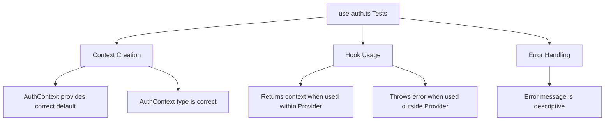
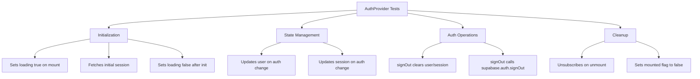
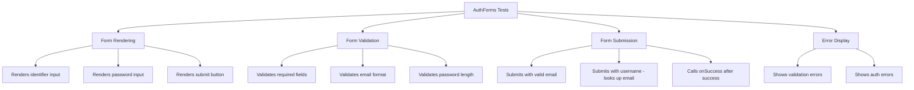
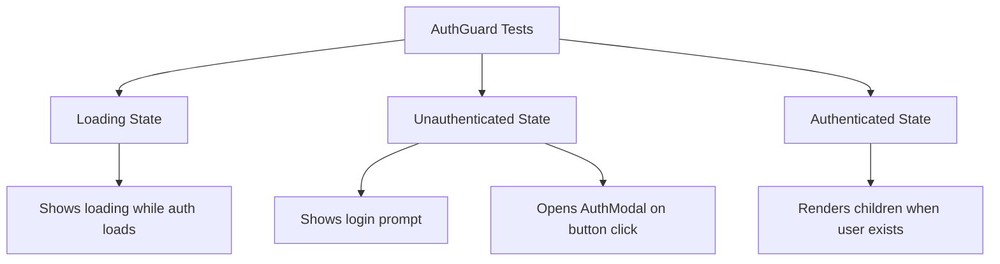
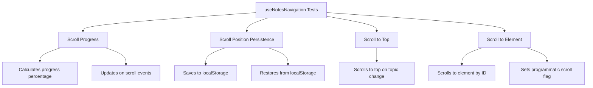
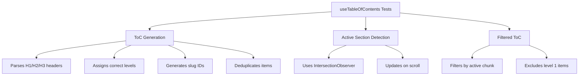
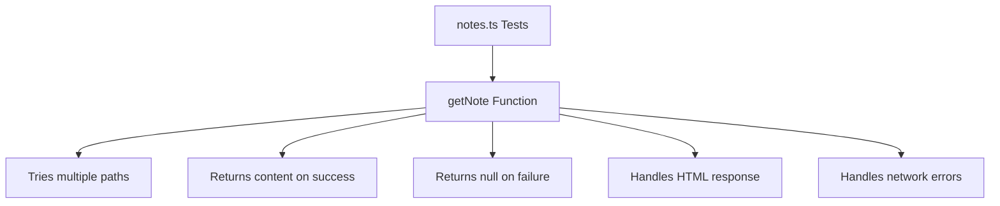

# Test Coverage Improvement Plan

## Current State Analysis

### Test Statistics

- **Total Test Files**: 18
- **Total Source Files**: ~194
- **File-based Coverage**: ~9.3%

### Existing Test Structure

```
src/__tests__/
├── setup.ts                          # localStorage mock setup
├── features/
│   ├── efficiency/
│   │   └── use-efficiency-data.test.ts
│   ├── pomodoro/hooks/
│   │   └── use-pomodoro.test.ts
│   └── quiz/
│       ├── algoritma/srs.test.ts
│       ├── api/repository.test.ts
│       └── core/
│           ├── ai-generation.test.ts
│           ├── ai-quota.test.ts
│           └── engine.test.ts
└── shared/
    ├── services/
    │   ├── achievement.service.test.ts
    │   ├── activity.service.test.ts
    │   └── quiz.service.test.ts
    └── utils/
        ├── category-utils.test.ts
        ├── efficiency-math.test.ts
        ├── mastery-logic.test.ts
        ├── rank-utils.test.ts
        ├── sanitizeHtml.test.ts
        └── streak-utils.test.ts
```

### Identified Untested Areas

| Module       | Files                                                       | Priority | Complexity |
| ------------ | ----------------------------------------------------------- | -------- | ---------- |
| auth         | AuthProvider.tsx, use-auth.ts, AuthForms.tsx, AuthGuard.tsx | HIGH     | Medium     |
| notes        | useNotesNavigation.ts, useTableOfContents.ts, notes.ts      | MEDIUM   | Medium     |
| data-sync.ts | Not found in codebase                                       | N/A      | N/A        |

---

## Module 1: Auth Module Tests

### Files to Test

#### 1.1 `src/features/auth/hooks/use-auth.ts`

**Test Categories:**



**Test Cases:**

| Test Case                | Description                      | Priority |
| ------------------------ | -------------------------------- | -------- |
| Context default value    | Should have undefined as default | HIGH     |
| useAuth within provider  | Should return auth context       | HIGH     |
| useAuth outside provider | Should throw descriptive error   | HIGH     |

**Example Test Structure:**

```typescript
// use-auth.test.ts
describe('useAuth', () => {
  describe('Context', () => {
    it('should have undefined as default value', () => {
      // Test AuthContext default value
    });
  });

  describe('Hook Usage', () => {
    it('should return context when used within AuthProvider', () => {
      // Render hook within provider, verify context values
    });

    it('should throw error when used outside AuthProvider', () => {
      // Render hook without provider, expect error
    });
  });
});
```

---

#### 1.2 `src/features/auth/services/AuthProvider.tsx`

**Test Categories:**



**Test Cases:**

| Test Case              | Description                          | Mocks Needed                    |
| ---------------------- | ------------------------------------ | ------------------------------- |
| Initial loading state  | Should start with loading=true       | supabase.auth.getSession        |
| Session initialization | Should fetch and set initial session | supabase.auth.getSession        |
| Auth state change      | Should update on auth state change   | supabase.auth.onAuthStateChange |
| signOut functionality  | Should clear state and call supabase | supabase.auth.signOut           |
| Cleanup on unmount     | Should unsubscribe from auth changes | subscription.unsubscribe        |
| Error handling in init | Should handle getSession errors      | supabase.auth.getSession error  |

**Example Test Structure:**

```typescript
// AuthProvider.test.tsx
describe('AuthProvider', () => {
  describe('Initialization', () => {
    it('should start with loading state true', () => {
      // Test initial loading state
    });

    it('should fetch initial session on mount', async () => {
      // Mock supabase.auth.getSession
      // Verify session is fetched and set
    });

    it('should set loading false after initialization', async () => {
      // Wait for initialization
      // Verify loading is false
    });
  });

  describe('Auth State Changes', () => {
    it('should update user on auth state change', async () => {
      // Trigger auth state change
      // Verify user is updated
    });
  });

  describe('signOut', () => {
    it('should clear user and session', async () => {
      // Call signOut
      // Verify state is cleared
    });

    it('should call supabase.auth.signOut', async () => {
      // Call signOut
      // Verify supabase method called
    });
  });

  describe('Cleanup', () => {
    it('should unsubscribe on unmount', () => {
      // Render and unmount
      // Verify unsubscribe called
    });
  });
});
```

---

#### 1.3 `src/features/auth/components/AuthForms.tsx`

**Test Categories:**



**Test Cases:**

| Test Case                   | Description                   | Priority |
| --------------------------- | ----------------------------- | -------- |
| Form renders correctly      | All inputs and button present | HIGH     |
| Validation - empty fields   | Shows required error          | HIGH     |
| Validation - invalid email  | Shows email format error      | MEDIUM   |
| Validation - short password | Shows min length error        | HIGH     |
| Submit with email           | Calls signInWithPassword      | HIGH     |
| Submit with username        | Looks up email via RPC        | MEDIUM   |
| Success callback            | Calls onSuccess on success    | MEDIUM   |
| Error handling              | Shows toast on error          | HIGH     |

---

#### 1.4 `src/features/auth/components/AuthGuard.tsx`

**Test Categories:**



**Test Cases:**

| Test Case       | Description                 | Priority |
| --------------- | --------------------------- | -------- |
| Loading state   | Shows loading text          | HIGH     |
| Unauthenticated | Shows login prompt          | HIGH     |
| Authenticated   | Renders children            | HIGH     |
| Modal opening   | Opens modal on button click | MEDIUM   |

---

## Module 2: Notes Module Tests

### Files to Test

#### 2.1 `src/features/notes/hooks/useNotesNavigation.ts`

**Test Categories:**



**Test Cases:**

| Test Case                     | Description                | Priority |
| ----------------------------- | -------------------------- | -------- |
| Scroll progress calculation   | Correct percentage         | HIGH     |
| Save scroll position          | Saves to localStorage      | MEDIUM   |
| Restore scroll position       | Restores from localStorage | MEDIUM   |
| Scroll to top on topic change | Resets scroll              | MEDIUM   |
| handleScrollToId              | Scrolls to element         | HIGH     |
| Programmatic scroll flag      | Sets and clears flag       | LOW      |

---

#### 2.2 `src/features/notes/hooks/useTableOfContents.ts`

**Test Categories:**



**Test Cases:**

| Test Case               | Description              | Priority |
| ----------------------- | ------------------------ | -------- |
| ToC from markdown       | Parses headers correctly | HIGH     |
| Level assignment        | H1=2, H2=3, H3=4         | HIGH     |
| Slug generation         | Creates valid IDs        | MEDIUM   |
| Deduplication           | Removes duplicate IDs    | MEDIUM   |
| Active section tracking | Updates via observer     | MEDIUM   |
| currentChunkToC filter  | Filters correctly        | HIGH     |

---

#### 2.3 `src/features/notes/lib/notes.ts`

**Test Categories:**



**Test Cases:**

| Test Case        | Description               | Priority |
| ---------------- | ------------------------- | -------- |
| Successful fetch | Returns note content      | HIGH     |
| Fallback paths   | Tries alternate paths     | MEDIUM   |
| HTML rejection   | Rejects DOCTYPE responses | MEDIUM   |
| Network error    | Returns null gracefully   | HIGH     |
| Error logging    | Logs errors to console    | LOW      |

---

## Test Patterns and Best Practices

### Existing Patterns to Follow

Based on analysis of existing tests:

1. **Mock Structure** - Use `vi.mock()` at top level for external dependencies
2. **Mock Query Builder** - Use chainable mock pattern for Supabase queries
3. **Timer Control** - Use `vi.useFakeTimers()` for time-dependent tests
4. **Store Reset** - Reset Zustand stores in `beforeEach`
5. **Cleanup** - Clear mocks in `beforeEach`, restore in `afterEach`

### Recommended Test File Structure

```
src/__tests__/
├── features/
│   └── auth/
│       ├── hooks/
│       │   └── use-auth.test.ts
│       ├── services/
│       │   └── AuthProvider.test.tsx
│       └── components/
│           ├── AuthForms.test.tsx
│           └── AuthGuard.test.tsx
└── features/
    └── notes/
        ├── hooks/
        │   ├── useNotesNavigation.test.ts
        │   └── useTableOfContents.test.ts
        └── lib/
            └── notes.test.ts
```

---

## Implementation Roadmap

### Phase 1: Auth Module - HIGH PRIORITY

| Order | Test File             | Est. Test Cases | Dependencies              |
| ----- | --------------------- | --------------- | ------------------------- |
| 1     | use-auth.test.ts      | 3               | None                      |
| 2     | AuthProvider.test.tsx | 8               | use-auth.test.ts patterns |
| 3     | AuthForms.test.tsx    | 8               | React Testing Library     |
| 4     | AuthGuard.test.tsx    | 4               | AuthProvider mock         |

### Phase 2: Notes Module - MEDIUM PRIORITY

| Order | Test File                  | Est. Test Cases | Dependencies              |
| ----- | -------------------------- | --------------- | ------------------------- |
| 5     | notes.test.ts              | 5               | fetch mock                |
| 6     | useTableOfContents.test.ts | 6               | IntersectionObserver mock |
| 7     | useNotesNavigation.test.ts | 6               | DOM scroll mock           |

---

## Required Test Utilities

### Auth Testing Utilities

```typescript
// test-utils/auth.ts
export const createMockUser = (overrides = {}) => ({
  id: 'test-user-id',
  email: 'test@example.com',
  ...overrides,
});

export const createMockSession = (overrides = {}) => ({
  access_token: 'test-token',
  user: createMockUser(),
  ...overrides,
});
```

### Notes Testing Utilities

```typescript
// test-utils/notes.ts
export const createMockChunk = (overrides = {}) => ({
  section_title: 'Test Section',
  content: '# Header 1\n## Header 2\n### Header 3',
  ...overrides,
});

export const createMockLocalStorage = () => ({
  getItem: vi.fn(),
  setItem: vi.fn(),
  removeItem: vi.fn(),
  clear: vi.fn(),
});
```

---

## Coverage Goals

| Module  | Current | Target | Priority |
| ------- | ------- | ------ | -------- |
| auth    | 0%      | 80%    | HIGH     |
| notes   | 0%      | 70%    | MEDIUM   |
| Overall | 9.3%    | 20%    | -        |

---

## Notes on data-sync.ts

The file `shared/services/data-sync.ts` mentioned in the task was not found in the codebase. It may have been:

- Removed or renamed
- Moved to a different location
- Never existed

**Recommendation**: Search for data synchronization logic in other files or confirm if this file should exist.

---

## Summary

This plan adds **40+ new test cases** across **7 new test files**, targeting the two largest untested modules in the application. Following the existing test patterns ensures consistency and maintainability.

### Expected Coverage Improvement

- **Before**: 18 test files, ~9.3% coverage
- **After**: 25 test files, ~20% coverage (estimated)
